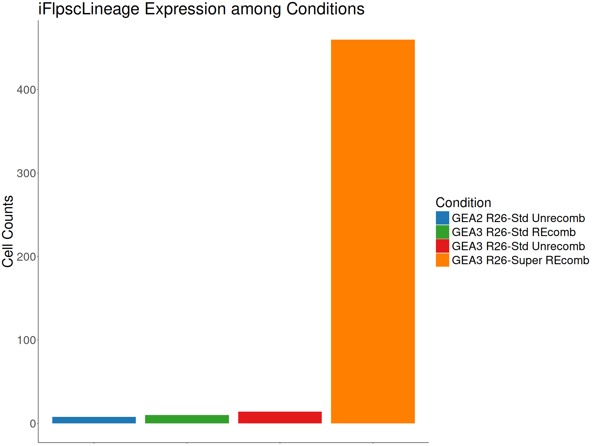
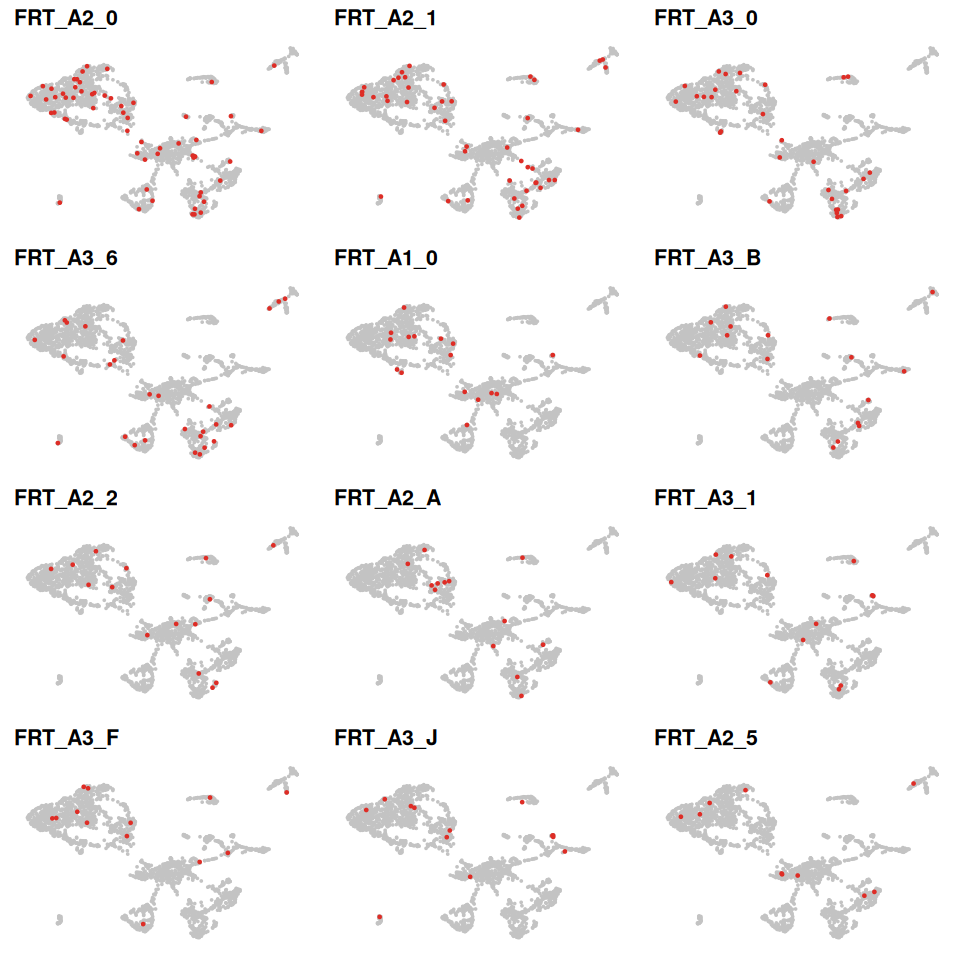
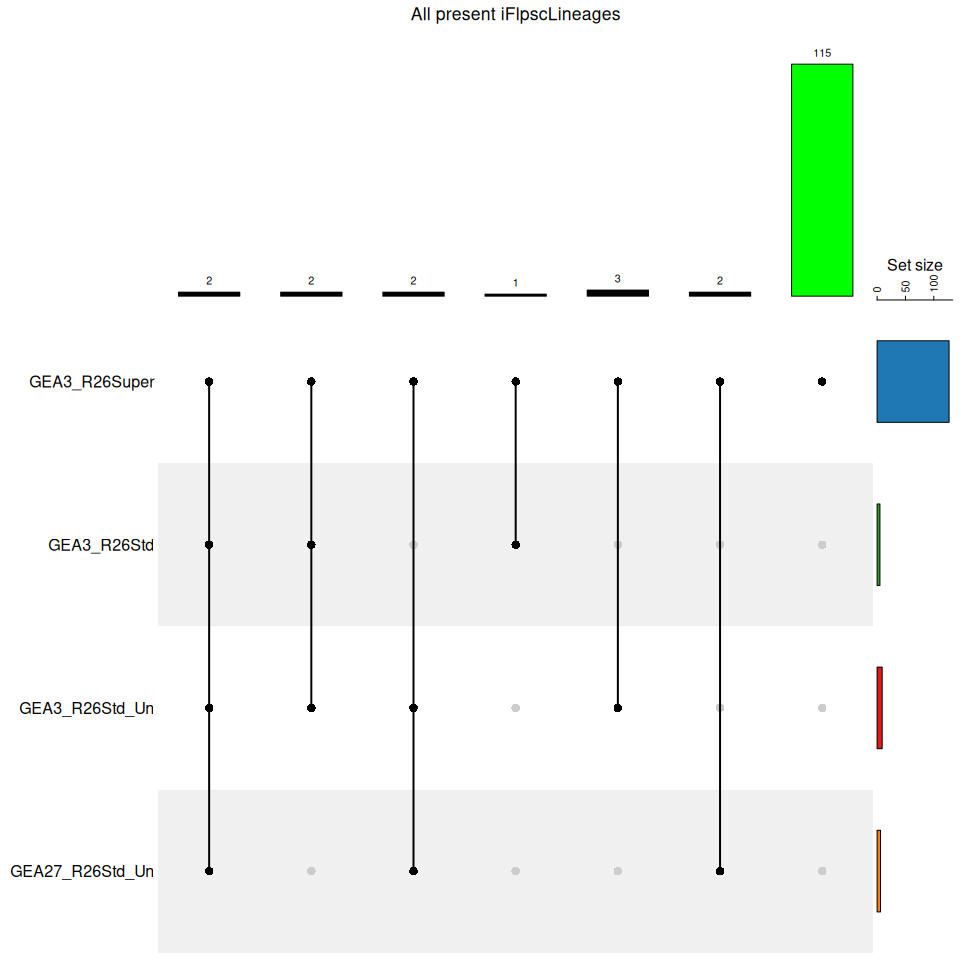

GEA_Founders_Clonal_Analysis
================
Alvaro Regano
2023-09-15

## Objective

We have the Nanopore RFRT_ONT data and we will correlate that data with
the 10x data and see where do the BCs match

## Set up the data

## Look into the proportions

    ##   Match_cells.Condition Freq
    ## 1 GEA2 R26-Std Unrecomb    8
    ## 2   GEA3 R26-Std REcomb   10
    ## 3 GEA3 R26-Std Unrecomb   14
    ## 4 GEA3 R26-Super REcomb  460

<!-- -->
And now we look at the total 10xBC cells present in the different
datasets

    ## [1]   52 2444

<!-- -->

Now let´s check the same in terms of Arrays

<!-- --><!-- --><!-- -->

# Cell BC match between Nanopore and 10x Library

<!-- -->

# Look into Nanopore Library Distribution and Complexity

<!-- -->
\# Passing clonal output of RPFR_ONT to the scRANSeq dataset

    ## Loading required package: gridExtra

    ## 
    ## Attaching package: 'gridExtra'

    ## The following object is masked from 'package:dplyr':
    ## 
    ##     combine

<!-- -->
\# Looking at Clonal Diversity and Homoplasy among GEA Founders

<!-- -->

<!-- -->

## Looking at expression of iFlpscLineage Arrays within the cells

<!-- -->

    ## [1] "GEA3 R26-Super REcomb" "GEA3 R26-Std REcomb"   "GEA3 R26-Std Unrecomb"
    ## [4] "GEA2 R26-Std Unrecomb"

<!-- --><!-- -->

    ## Warning in all_clones$clone <- "All": Coercing LHS to a list

<!-- -->

    ## Warning in clones_freq$clone <- myclone: Coercing LHS to a list

<!-- -->

    ## Warning: A numeric `legend.position` argument in `theme()` was deprecated in ggplot2
    ## 3.5.0.
    ## ℹ Please use the `legend.position.inside` argument of `theme()` instead.
    ## This warning is displayed once every 8 hours.
    ## Call `lifecycle::last_lifecycle_warnings()` to see where this warning was
    ## generated.

<!-- -->

<!-- -->

# Applying Pseudopathmatrix on GEA12 Fully Recombined cells

    ## [1] 22

    ## [1] 22

<!-- -->

## Looking at the Frequencies of each recombined BC given by the full recombination pseudopathmatrix

As this dataset is produced with constitutively expressed FlpO
recombinase, I will take only the last two rows of my simulated
pathmatrix and sum them row by row (this gives the best simulated BC
frequency to compare with, as it adreeses inversions among each
recombination step as well). With the Frequency values extracted I will
match them with the iFLpscLineage BCs present in the dataset

    ## [1] 0.6008455

    ## Warning: Using `by = character()` to perform a cross join was deprecated in dplyr 1.1.0.
    ## ℹ Please use `cross_join()` instead.
    ## This warning is displayed once every 8 hours.
    ## Call `lifecycle::last_lifecycle_warnings()` to see where this warning was
    ## generated.

<!-- -->

    ##      0    0-0  0-0-0  0-0-1  0-0-6  0-0-J    0-1  0-1-6  0-1-B  0-1-J 0-12-F 
    ##     15      3      1      1      2      1      2      1      1      1      1 
    ##    0-2    0-5  0-5-0  0-5-B  0-5-J  0-A-B    0-F    0-0    0-1    0-2    0-6 
    ##      3      1      1      1      1      1      1      7      2      1      3 
    ##    0-B   0-B0    0-F    0-J     0A      1    1-0    1-5    1-6  1-6-2    1-A 
    ##      4      1      7      1      1      6      1      1      1      2      2 
    ##  1-F-B    1-0    1-1    1-6    1-J     10   10-5   10-6   1D-0      2    2-0 
    ##      1      1      1      1      1      1      1      1      1      1      2 
    ##  2-0-6    2-1  2-2-6    2-6    2-F  4-1-1    4-J      5    5-0    5-1    5-5 
    ##      1      1      1      1      1      1      1      5      1      1      1 
    ##    5-A    5-2    6-6      9    9-6    A-J      B  B-0-F    B-A  B-A-0    B-6 
    ##      1      1      1      1      1      1      1      1      1      1      1 
    ## CB-1-0  D-1-0    D-0    D-J      E    E-J      0    0-0    0-1    0-2    0-6 
    ##      1      1      1      1      1      1     54      9      3      1      2 
    ##    0-A    0-B    0-F    0-J      1    1-0    1-1    1-2    1-6    1-B    1-J 
    ##      1      3      1      3     38      6      3      2      4      1      3 
    ##     10   10-1     12   12-6      2    2-6    2-F      5    5-0    5-6    5-B 
    ##      1      1      6      1     11      7      3      9      1      1      2 
    ##    5-F    5-J     50     56      6    6-0    6-2      A    A-0    A-1    A-6 
    ##      1      2      1      1      3      1      1     13      3      1      2 
    ##    A-J     A2      E      F      J    J-0    J-J      0      1     10      2 
    ##      2      2      8      1      5      1      1     30     13      3      4 
    ##      6      A      B     B0      F      J 
    ##     23      1     14      1     11     12

    ## NULL

    ## Warning: Removed 11 rows containing non-finite outside the scale range
    ## (`stat_bin()`).

    ## Warning: Removed 6 rows containing missing values or values outside the scale range
    ## (`geom_bar()`).

<!-- -->

<!-- -->

## Producing a Proper BC table with Probabilities, clonesize and arrays expressed

<!-- -->

## Unique Clonal BCs in dataset

<!-- --><!-- -->

# R session

    ## R version 4.3.3 (2024-02-29)
    ## Platform: x86_64-pc-linux-gnu (64-bit)
    ## Running under: Ubuntu 24.04 LTS
    ## 
    ## Matrix products: default
    ## BLAS:   /usr/lib/x86_64-linux-gnu/blas/libblas.so.3.12.0 
    ## LAPACK: /usr/lib/x86_64-linux-gnu/lapack/liblapack.so.3.12.0
    ## 
    ## locale:
    ##  [1] LC_CTYPE=en_US.UTF-8       LC_NUMERIC=C              
    ##  [3] LC_TIME=en_US.UTF-8        LC_COLLATE=en_US.UTF-8    
    ##  [5] LC_MONETARY=en_US.UTF-8    LC_MESSAGES=en_US.UTF-8   
    ##  [7] LC_PAPER=en_US.UTF-8       LC_NAME=C                 
    ##  [9] LC_ADDRESS=C               LC_TELEPHONE=C            
    ## [11] LC_MEASUREMENT=en_US.UTF-8 LC_IDENTIFICATION=C       
    ## 
    ## time zone: Europe/Madrid
    ## tzcode source: system (glibc)
    ## 
    ## attached base packages:
    ## [1] grid      stats     graphics  grDevices utils     datasets  methods  
    ## [8] base     
    ## 
    ## other attached packages:
    ##  [1] VennDetail_1.18.0     gridExtra_2.3         scatterpie_0.2.3     
    ##  [4] ComplexHeatmap_2.18.0 UpSetR_1.4.0          readxl_1.4.3         
    ##  [7] VennDiagram_1.7.3     futile.logger_1.4.3   RColorBrewer_1.1-3   
    ## [10] dittoSeq_1.14.3       patchwork_1.2.0       Seurat_5.1.0         
    ## [13] SeuratObject_5.0.2    sp_2.1-4              lubridate_1.9.3      
    ## [16] forcats_1.0.0         stringr_1.5.1         purrr_1.0.2          
    ## [19] readr_2.1.5           tidyr_1.3.1           tibble_3.2.1         
    ## [22] ggplot2_3.5.1         tidyverse_2.0.0       dplyr_1.1.4          
    ## [25] openxlsx_4.2.6.1     
    ## 
    ## loaded via a namespace (and not attached):
    ##   [1] RcppAnnoy_0.0.22            splines_4.3.3              
    ##   [3] later_1.3.2                 bitops_1.0-8               
    ##   [5] cellranger_1.1.0            polyclip_1.10-7            
    ##   [7] fastDummies_1.7.3           lifecycle_1.0.4            
    ##   [9] doParallel_1.0.17           vroom_1.6.5                
    ##  [11] globals_0.16.3              lattice_0.22-5             
    ##  [13] MASS_7.3-60.0.1             magrittr_2.0.3             
    ##  [15] plotly_4.10.4               rmarkdown_2.27             
    ##  [17] yaml_2.3.10                 httpuv_1.6.15              
    ##  [19] sctransform_0.4.1           spam_2.10-0                
    ##  [21] zip_2.3.1                   spatstat.sparse_3.1-0      
    ##  [23] reticulate_1.38.0           cowplot_1.1.3              
    ##  [25] pbapply_1.7-2               abind_1.4-5                
    ##  [27] zlibbioc_1.48.2             Rtsne_0.17                 
    ##  [29] GenomicRanges_1.54.1        BiocGenerics_0.48.1        
    ##  [31] RCurl_1.98-1.16             tweenr_2.0.3               
    ##  [33] circlize_0.4.16             GenomeInfoDbData_1.2.11    
    ##  [35] IRanges_2.36.0              S4Vectors_0.40.2           
    ##  [37] ggrepel_0.9.5               irlba_2.3.5.1              
    ##  [39] listenv_0.9.1               spatstat.utils_3.0-5       
    ##  [41] pheatmap_1.0.12             goftest_1.2-3              
    ##  [43] RSpectra_0.16-2             spatstat.random_3.3-1      
    ##  [45] fitdistrplus_1.2-1          parallelly_1.38.0          
    ##  [47] leiden_0.4.3.1              codetools_0.2-19           
    ##  [49] DelayedArray_0.28.0         ggforce_0.4.2              
    ##  [51] shape_1.4.6.1               tidyselect_1.2.1           
    ##  [53] farver_2.1.2                matrixStats_1.3.0          
    ##  [55] stats4_4.3.3                spatstat.explore_3.3-1     
    ##  [57] jsonlite_1.8.8              GetoptLong_1.0.5           
    ##  [59] progressr_0.14.0            ggridges_0.5.6             
    ##  [61] survival_3.5-8              iterators_1.0.14           
    ##  [63] foreach_1.5.2               tools_4.3.3                
    ##  [65] ica_1.0-3                   Rcpp_1.0.13                
    ##  [67] glue_1.7.0                  SparseArray_1.2.4          
    ##  [69] xfun_0.46                   MatrixGenerics_1.14.0      
    ##  [71] GenomeInfoDb_1.38.8         withr_3.0.1                
    ##  [73] formatR_1.14                fastmap_1.2.0              
    ##  [75] fansi_1.0.6                 digest_0.6.36              
    ##  [77] timechange_0.3.0            R6_2.5.1                   
    ##  [79] mime_0.12                   colorspace_2.1-1           
    ##  [81] scattermore_1.2             tensor_1.5                 
    ##  [83] spatstat.data_3.1-2         utf8_1.2.4                 
    ##  [85] generics_0.1.3              data.table_1.15.4          
    ##  [87] httr_1.4.7                  htmlwidgets_1.6.4          
    ##  [89] S4Arrays_1.2.1              uwot_0.2.2                 
    ##  [91] pkgconfig_2.0.3             gtable_0.3.5               
    ##  [93] lmtest_0.9-40               SingleCellExperiment_1.24.0
    ##  [95] XVector_0.42.0              htmltools_0.5.8.1          
    ##  [97] dotCall64_1.1-1             clue_0.3-65                
    ##  [99] scales_1.3.0                Biobase_2.62.0             
    ## [101] png_0.1-8                   spatstat.univar_3.0-0      
    ## [103] ggfun_0.1.5                 knitr_1.48                 
    ## [105] lambda.r_1.2.4              rstudioapi_0.16.0          
    ## [107] rjson_0.2.21                tzdb_0.4.0                 
    ## [109] reshape2_1.4.4              nlme_3.1-164               
    ## [111] zoo_1.8-12                  GlobalOptions_0.1.2        
    ## [113] KernSmooth_2.23-22          parallel_4.3.3             
    ## [115] miniUI_0.1.1.1              pillar_1.9.0               
    ## [117] vctrs_0.6.5                 RANN_2.6.1                 
    ## [119] promises_1.3.0              xtable_1.8-4               
    ## [121] cluster_2.1.6               evaluate_0.24.0            
    ## [123] cli_3.6.3                   compiler_4.3.3             
    ## [125] futile.options_1.0.1        rlang_1.1.4                
    ## [127] crayon_1.5.3                future.apply_1.11.2        
    ## [129] labeling_0.4.3              plyr_1.8.9                 
    ## [131] stringi_1.8.4               viridisLite_0.4.2          
    ## [133] deldir_2.0-4                munsell_0.5.1              
    ## [135] lazyeval_0.2.2              spatstat.geom_3.3-2        
    ## [137] Matrix_1.6-5                RcppHNSW_0.6.0             
    ## [139] hms_1.1.3                   bit64_4.0.5                
    ## [141] future_1.34.0               shiny_1.9.1                
    ## [143] highr_0.11                  SummarizedExperiment_1.32.0
    ## [145] ROCR_1.0-11                 igraph_2.0.3               
    ## [147] bit_4.0.5
