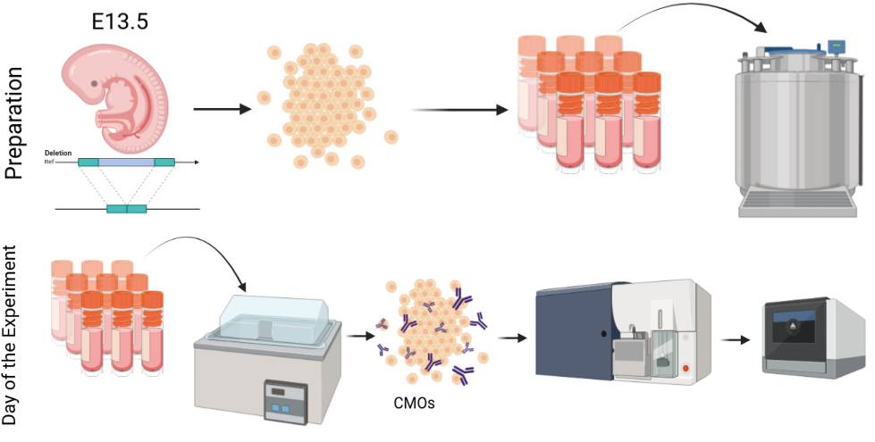
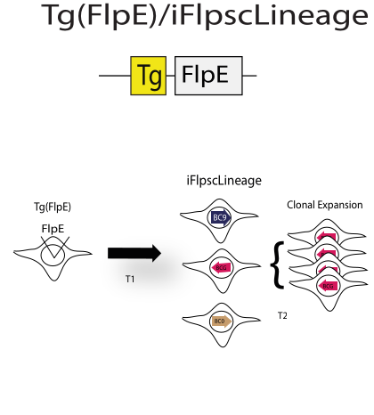

# Constitutive Recombination Validation Analysis

## Experimental design

The experiment was designed with the early progeny of iFlpscLineage mice. Four groups of embryos from the GEA progeny were processed, each representing distinct iFlpscLineage integration scenarios. One group was progeny had iFlpscLineage inserted in the targeted region (GEA3 R26-Super Recomb).  Two other groups also came from the same progeny but had iFlpscLineage inserted in a weaker region previously tested (GEA3 R26-Std). One group possessed the Tg(FlpE) allele (Recomb) and another iFlpscLineage alone (Unrecomb). Finally, we had a group belonging to a founder that only expressed iFlpscLineage in the R26-Std and its progeny did not have the Tg(FlpE) allele (GEA2 R26-Std Unrecomb).

## Barcoding

We employed the Tg (FlpE)/iFlpscLineage alleles, that would allow for ubiquitous recombination of barcodes from conception onwards.

