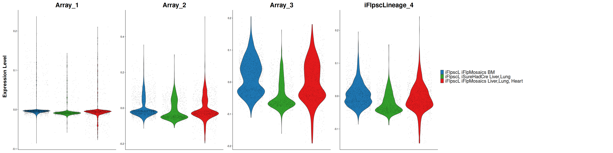
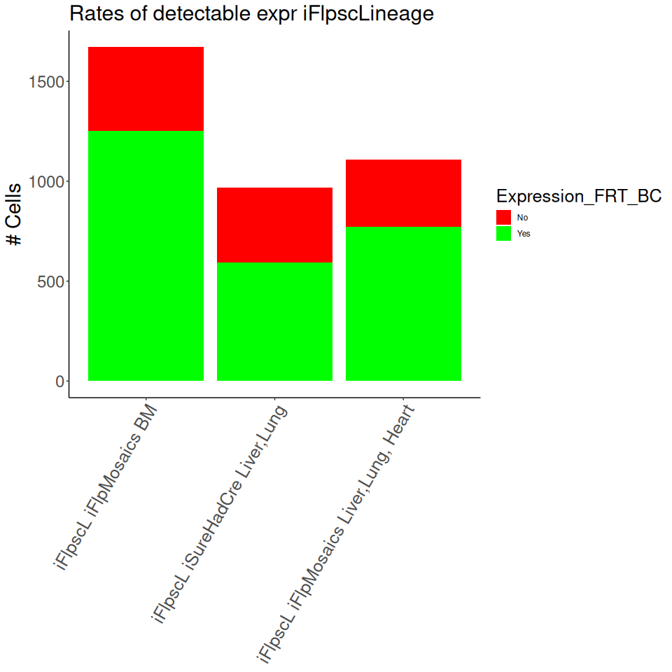
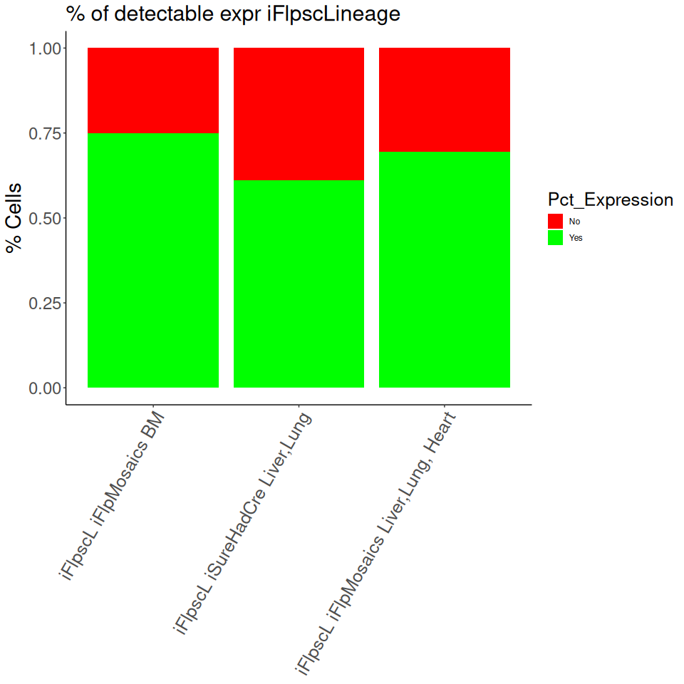
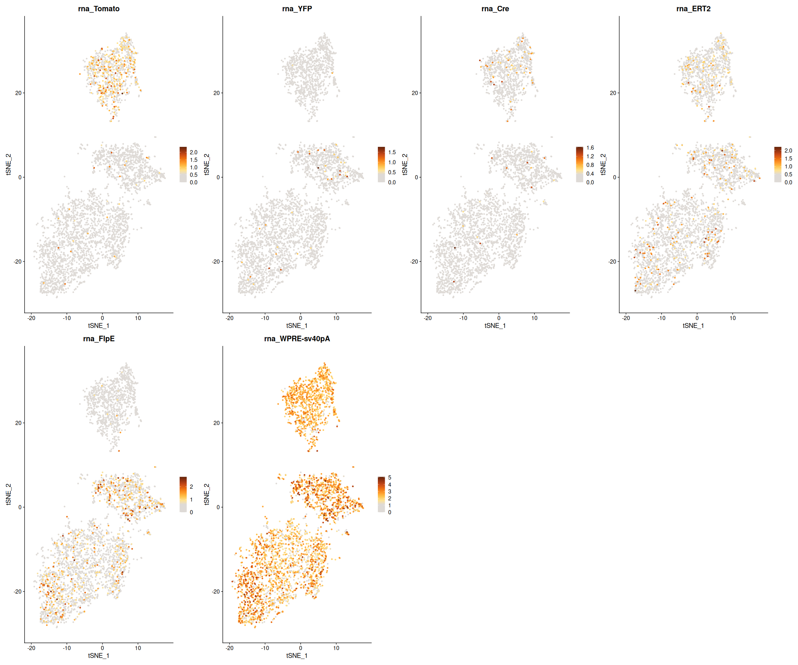

GEA_Partial_Recombination_Analysis
================
Alvaro Regano
16/06/2024

# GEA Partial Recombination Analysis

# Objective

Take a look at the GEA line that was Partially recombined and check if
it was successful for a following Nanopore sequencing

# Analysis

The dataset conditions is as follows

    ##            Mouse          Recomb             Tissue   Injection Substance Processing
    ## 1         GEA107    FlpOERT2xEMT        Bone Marrow P5 14/12/23  4OHT Std    22Jan23
    ## 2 GEA107,110,111    FlpOERT2xEMT Liver, Lung, Heart P5 14/12/23  4OHT Std    22Jan23
    ## 3          GEA99 VEQxiHadSureCre        Liver, Lung 26-27/01/24 Tamox Std    02Feb24

## Module Scores of the iFlpscLineage cassette

First We will look at the Barcodes grouped to see how the expression
rates change

    ## [1] "GEA107_FlpOERT2xEMT"             "GEA99_VEQxAJD"                   "GEA107_110_111_FlpOERT2xEMT_Neg"

Violin Plots show that Array3 has the highest rate of expression

We can also look at the % of cells expressing iFlpscLineage in the
dataset

## Looking at Expression rates of iFlpscLinage per cell

Now in terms of % of counts in the dataset

The expression rate is much more modest in the Adult mice than in
Embryos. FlpOERT2xEMT show similar expression rates as VEQxAJD even
though injections were performed a week before and Tamoxifen instead of
4OHT

We can take a look at rates of expression among arrays

Let’s check the number and percentage of cells expressing more than one
Array in the dataset

Now the difference of levels of expression among arrays is much more
than with the embryos. Array 3 is much more expressed than the others,
then Array 2 and Array1

## Looking at the Distribution of FRT-BCs throughout the populations

### Looking at FRT-BC Mean Counts per cell

### Looking at FRT-BC Counts

And Now instead of Mean counts per cell lets look at the total counts in
the dataset

Seeing that most reads fall in the A-0 BC indicates mostly unrecombined
BCs, but specially on A3 you can see counts of BCs that can indicate
Partial recombination. A1 Array seems to not have undergone much
recombination. FlpOERT2xEMT show much higher recombination rates than
VEQxAJD

## Doing a ratio analysis between Fwd and Inverted BC segment

The ratio analysis between Inv/Fwd BC segments indicate a good level of
Iverted BCs present in the dataset

## Looking at the Distribution of other transgenes in the populations

### Looking at Transgene Counts

And Now instead of Mean counts per cell lets look at the total counts in
the dataset

## Looking at the other Transgenes present in the dataset

# Conclusion

Here we look at Partial recombination using FlpOERT2xEMT and
VEQxiHadSureCre strategies. The FlpOERT2xEMT was induced twice with Std
Dose Tamoxifen one week before processing. VEQxiHadSureCre were induced
at P5 with a Std 4OHT Dose and Processed a month and a week later.
Overall, detection and recombination is higher in Array3, then 2 then 1,
no matter the group. Detection of BCs is higher in FlpOERT2xEMT than in
VEQxiSureHadCre and the same with the recombination rate.

Until we do not do Nanopore sequencing we will not be certain of the
extent of the Partial Recombination. While in VEQxiSureHadCre it does
not look very promising, FlpOERT2xEMT could have a good level of
Partially recombined BCs.

NOTE: The group GEA107_110_111_FlpOERT2xEMT_Neg was produced with the
Negative Hashtag group. The CMO used for identifying this group failed
(CMO311), so mosto (but not all) negative cells belong to this group.

# R session

    ## R version 4.3.3 (2024-02-29)
    ## Platform: x86_64-pc-linux-gnu (64-bit)
    ## Running under: Ubuntu 24.04 LTS
    ## 
    ## Matrix products: default
    ## BLAS:   /usr/lib/x86_64-linux-gnu/blas/libblas.so.3.12.0 
    ## LAPACK: /usr/lib/x86_64-linux-gnu/lapack/liblapack.so.3.12.0
    ## 
    ## locale:
    ##  [1] LC_CTYPE=en_US.UTF-8       LC_NUMERIC=C               LC_TIME=en_US.UTF-8        LC_COLLATE=en_US.UTF-8     LC_MONETARY=en_US.UTF-8    LC_MESSAGES=en_US.UTF-8    LC_PAPER=en_US.UTF-8       LC_NAME=C                  LC_ADDRESS=C               LC_TELEPHONE=C             LC_MEASUREMENT=en_US.UTF-8 LC_IDENTIFICATION=C       
    ## 
    ## time zone: Europe/Madrid
    ## tzcode source: system (glibc)
    ## 
    ## attached base packages:
    ## [1] stats     graphics  grDevices utils     datasets  methods   base     
    ## 
    ## other attached packages:
    ##  [1] cowplot_1.1.3      RColorBrewer_1.1-3 tidyr_1.3.1        patchwork_1.2.0    yaml_2.3.10        rmarkdown_2.27     dplyr_1.1.4        ggplot2_3.5.1      Seurat_5.1.0       SeuratObject_5.0.2 sp_2.1-4           knitr_1.48        
    ## 
    ## loaded via a namespace (and not attached):
    ##   [1] deldir_2.0-4           pbapply_1.7-2          gridExtra_2.3          rlang_1.1.4            magrittr_2.0.3         RcppAnnoy_0.0.22       spatstat.geom_3.3-2    matrixStats_1.3.0      ggridges_0.5.6         compiler_4.3.3         png_0.1-8              vctrs_0.6.5            reshape2_1.4.4         stringr_1.5.1          pkgconfig_2.0.3        fastmap_1.2.0          labeling_0.4.3         utf8_1.2.4             promises_1.3.0         purrr_1.0.2            xfun_0.46              jsonlite_1.8.8         goftest_1.2-3          highr_0.11             later_1.3.2            spatstat.utils_3.0-5   irlba_2.3.5.1          parallel_4.3.3         cluster_2.1.6          R6_2.5.1               ica_1.0-3              stringi_1.8.4          spatstat.data_3.1-2    reticulate_1.38.0      parallelly_1.38.0      spatstat.univar_3.0-0  lmtest_0.9-40          scattermore_1.2        Rcpp_1.0.13            tensor_1.5             future.apply_1.11.2    zoo_1.8-12             sctransform_0.4.1      httpuv_1.6.15          Matrix_1.6-5           splines_4.3.3          igraph_2.0.3           tidyselect_1.2.1       abind_1.4-5            rstudioapi_0.16.0      spatstat.random_3.3-1  codetools_0.2-19       miniUI_0.1.1.1         spatstat.explore_3.3-1 listenv_0.9.1          lattice_0.22-5         tibble_3.2.1           plyr_1.8.9             withr_3.0.1            shiny_1.9.1            ROCR_1.0-11            evaluate_0.24.0        Rtsne_0.17             future_1.34.0          fastDummies_1.7.3      survival_3.5-8         polyclip_1.10-7        fitdistrplus_1.2-1     pillar_1.9.0           KernSmooth_2.23-22     plotly_4.10.4          generics_0.1.3         RcppHNSW_0.6.0         munsell_0.5.1          scales_1.3.0           globals_0.16.3         xtable_1.8-4           glue_1.7.0             lazyeval_0.2.2         tools_4.3.3            data.table_1.15.4      RSpectra_0.16-2        RANN_2.6.1             leiden_0.4.3.1         dotCall64_1.1-1        grid_4.3.3             colorspace_2.1-1       nlme_3.1-164           cli_3.6.3              spatstat.sparse_3.1-0  spam_2.10-0            fansi_1.0.6            viridisLite_0.4.2      uwot_0.2.2             gtable_0.3.5           digest_0.6.36          progressr_0.14.0       ggrepel_0.9.5          farver_2.1.2           htmlwidgets_1.6.4      htmltools_0.5.8.1      lifecycle_1.0.4        httr_1.4.7             mime_0.12              MASS_7.3-60.0.1
