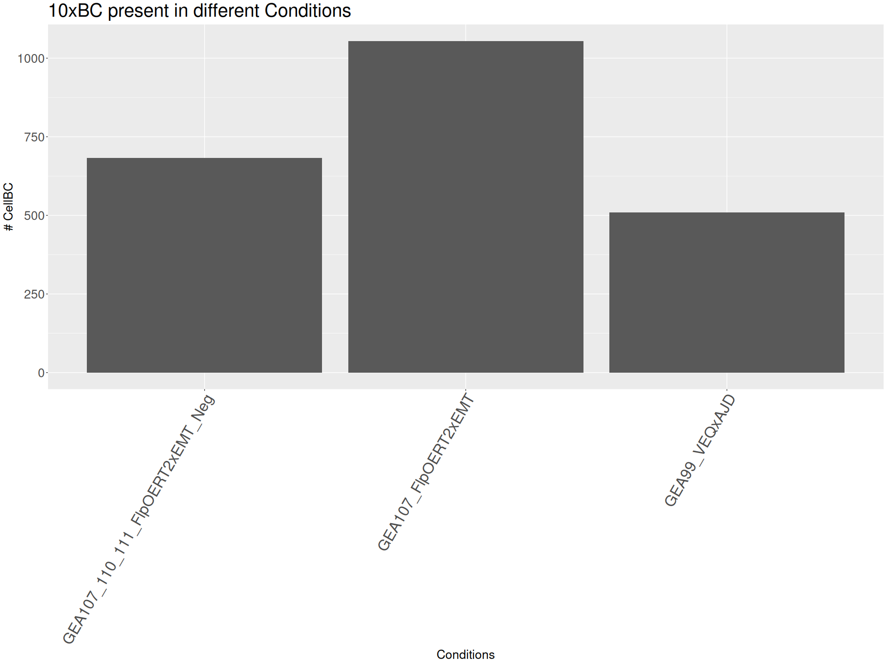
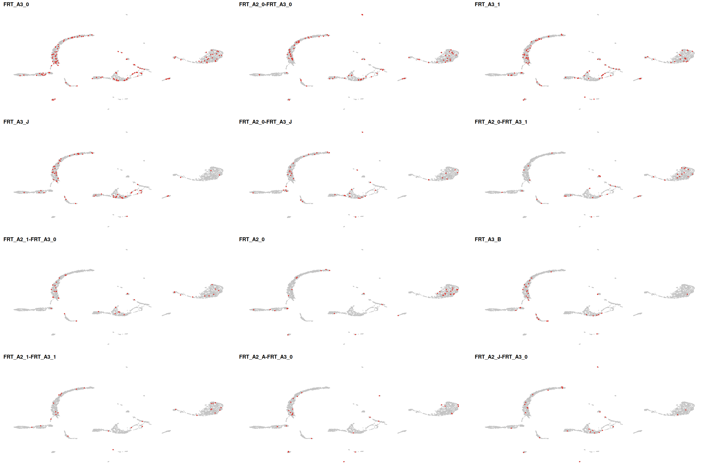
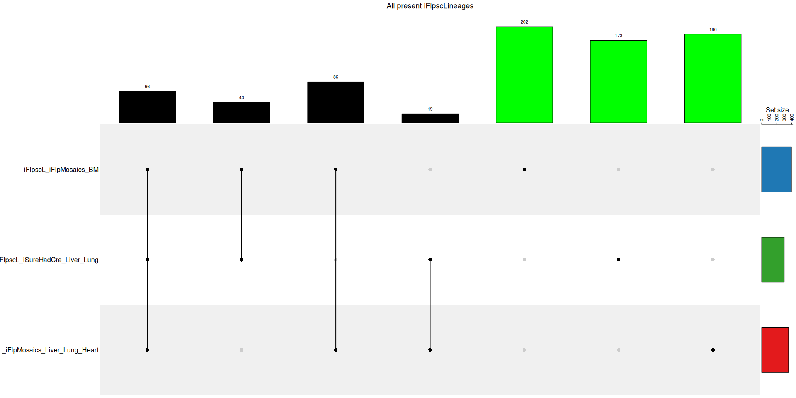

GEA_Partial_Recombination_Clonal_Analysis
================
Alvaro Regano
2024-06-24

``` r
# Fix repeated reads entries

A1_BCs <- A1_BCs %>% filter(!grepl("c", Corrected_10xBC))
A1_BCs <- A1_BCs %>% filter(!grepl("(.)\\1{1,}", Majority_FRT_BC))

A2_BCs <- A2_BCs %>% filter(!grepl("c", Corrected_10xBC))
A2_BCs <- A2_BCs %>% filter(!grepl("(.)\\1{1,}", Majority_FRT_BC))

A3_BCs <- A3_BCs %>% filter(!grepl("c", Corrected_10xBC))
A3_BCs <- A3_BCs %>% filter(!grepl("(.)\\1{1,}", Majority_FRT_BC))
```

## Objective

We have the Nanopore RFRT_ONT data and we will correlate that data with
the 10x data and see where do the BCs match

## Set up the data

``` r
names(A1_BCs) <- c("BC10x", "A1_FRT_BC", "Count_A1")
names(A2_BCs) <- c("BC10x", "A2_FRT_BC", "Count_A2")
names(A3_BCs) <- c("BC10x", "A3_FRT_BC", "Count_A3")

BCs_1 <- merge(A1_BCs, A2_BCs, all = T)

BCs <- merge(BCs_1, A3_BCs, all = T)

Cell_id <- BCs[,1]

Cell_id <- unlist(lapply(Cell_id, function(x) paste0(x, "-1")))

Match_cells <- GEA_metadata[GEA_metadata$X %in% Cell_id, ]
```

## Look into the proportions

``` r
Conditions_df <- data.frame(Match_cells$Condition)

ggplot(Conditions_df, aes(x = Match_cells.Condition)) +
  geom_bar() +
  labs(title = "10xBC present in different Conditions", x = "Conditions", y = "# CellBC")+
  theme(axis.text.x.bottom = element_text(angle = 60, hjust = 1, size = 25), plot.title = element_text(size = 30), axis.title = element_text(size = 20), axis.text.y = element_text(size = 20))
```

<!-- -->
And now we look at the total 10xBC cells present in the different
datasets

``` r
GEA_Partial_recomb <- readRDS("../rds/GEA_Partial_Recombination.rds")

DefaultAssay(GEA_Partial_recomb) <- "RNA"
Count.matrix <- GEA_Partial_recomb@assays[["RNA"]]
all.genes <- rownames(GEA_Partial_recomb)
# get FRT BC genes 
FRT_BCs <- tail(all.genes, n = 62) # ALL genes
FRT_BCs <- FRT_BCs[1:59]
# write.csv(file = "all_bcs.txt", x = BC_genes,quote =F,row.names = F,col.names = F)

# subset the matrix to include only the shared genes
x = rownames(Count.matrix) %in% FRT_BCs

FRT.matrix <- Count.matrix[x,]
```

    ## Warning: Layer 'FALSE' is empty

``` r
dim(FRT.matrix)
```

    ## NULL

``` r
percentage_FRT_BC <- GEA_Partial_recomb@meta.data[c("Condition","FRT_BCs")]

percentage_FRT_BC$Expression_FRT_BC <- "No"

for (i in 1:nrow(percentage_FRT_BC)){
  if (percentage_FRT_BC$FRT_BCs[i] > 0){
    percentage_FRT_BC$Expression_FRT_BC[i] <- "Yes"
  }
    
}

GEA_Partial_recomb <- AddMetaData(GEA_Partial_recomb, percentage_FRT_BC)


FRT_Cells_10x <- GEA_Partial_recomb@meta.data[GEA_Partial_recomb@meta.data$Expression_FRT_BC == "Yes", ]
```

``` r
Cells_in_dataset <- c(nrow(GEA_metadata), nrow(BCs), nrow(Match_cells))

x <- list(
  x10x_Library = GEA_metadata$X,
  iFlpscLineage_10x = rownames(FRT_Cells_10x),
  Nanopore_Library = Cell_id
)

# Generate plot

# cairo_pdf("../Plots/Venn_diagram_10x_match_Nanopore_1.pdf", height = 10, width = 9)
v <- venn.diagram(x,
                  fill = c("orange", "red", "blue"),
                  alpha = c(0.5, 0.5, 0.5),
                  cat.cex = 2, cex=3,
                  filename=NULL,
                  main = "Cell ID Match between 10x Library and Nanopore",
                  sub = "3750 Cells in 10x Dataset",
                  main.cex = 2.5,
                  sub.cex = 2,
                  # fontfamily = "Arial",
                  cat.dist = -0.025)

# have a look at the default plot
grid.newpage()
grid.draw(v)
```

<!-- -->

``` r
# dev.off()
```

Now let´s check the same in terms of Arrays

``` r
GEA_Partial_recomb <- PercentageFeatureSet(GEA_Partial_recomb, "^A[1-3]-", col.name = "FRT_BCs")

GEA_Partial_recomb <- PercentageFeatureSet(GEA_Partial_recomb, "^A1-", col.name = "A1_FRT_BCs")
GEA_Partial_recomb <- PercentageFeatureSet(GEA_Partial_recomb, "^A2-", col.name = "A2_FRT_BCs")
GEA_Partial_recomb <- PercentageFeatureSet(GEA_Partial_recomb, "^A3-", col.name = "A3_FRT_BCs")


percentage_FRT_BC_Arrays <- GEA_Partial_recomb@meta.data[c("Condition", "A1_FRT_BCs", "A2_FRT_BCs", "A3_FRT_BCs")]

percentage_FRT_BC_Arrays$Expression_FRT_BC_A1 <- "No"
percentage_FRT_BC_Arrays$Expression_FRT_BC_A2 <- "No"
percentage_FRT_BC_Arrays$Expression_FRT_BC_A3 <- "No"

for (i in 1:nrow(percentage_FRT_BC_Arrays)){
  if (percentage_FRT_BC_Arrays$A1_FRT_BCs[i] > 0){
    percentage_FRT_BC_Arrays$Expression_FRT_BC_A1[i] <- "Yes"
  }
  if (percentage_FRT_BC_Arrays$A2_FRT_BCs[i] > 0){
    percentage_FRT_BC_Arrays$Expression_FRT_BC_A2[i] <- "Yes"
  }
  if (percentage_FRT_BC_Arrays$A3_FRT_BCs[i] > 0){
    percentage_FRT_BC_Arrays$Expression_FRT_BC_A3[i] <- "Yes"
  }
    
}


# Array 1

x <- list(
  x10x_Library = GEA_metadata$X,
  iFlpscLineage_10x = rownames(GEA_Partial_recomb@meta.data[GEA_Partial_recomb@meta.data$A1_FRT_BCs > 0, ]),
  Nanopore_Library = unlist(lapply(A1_BCs$BC10x, function(x) paste0(x, "-1")))
)

# Generate plot

# cairo_pdf("../Plots/Venn_diagram_10x_match_Nanopore_Array_1.pdf", height = 10, width = 9)
v <- venn.diagram(x,
                  fill = c("orange", "red", "blue"),
                  alpha = c(0.5, 0.5, 0.5),
                  cat.cex = 2, cex=3,
                  filename=NULL,
                  main = "Cell ID Match between 10x Library and Nanopore",
                  sub = "Array 1",
                  main.cex = 2.5,
                  sub.cex = 2,
                  # fontfamily = "Arial",
                  cat.dist = -0.025)

# have a look at the default plot
grid.newpage()
grid.draw(v)
```

<!-- -->

``` r
# dev.off()

# Array 2 (I do not have it yet)

x <- list(
  x10x_Library = GEA_metadata$X,
  iFlpscLineage_10x = rownames(GEA_Partial_recomb@meta.data[GEA_Partial_recomb@meta.data$A2_FRT_BCs > 0, ]),
  Nanopore_Library = unlist(lapply(A2_BCs$BC10x, function(x) paste0(x, "-1")))
)

# Generate plot

# cairo_pdf("../Plots/Venn_diagram_10x_match_Nanopore_Array_2.pdf", height = 10, width = 9)
v <- venn.diagram(x,
                  fill = c("orange", "red", "blue"),
                  alpha = c(0.5, 0.5, 0.5),
                  cat.cex = 2, cex=3,
                  filename=NULL,
                  main = "Cell ID Match between 10x Library and Nanopore",
                  sub = "Array 2",
                  main.cex = 2.5,
                  sub.cex = 2,
                  # fontfamily = "Arial",
                  cat.dist = -0.025)

# have a look at the default plot
grid.newpage()
grid.draw(v)
```

<!-- -->

``` r
# dev.off()

# Array 3

x <- list(
  x10x_Library = GEA_metadata$X,
  iFlpscLineage_10x = rownames(GEA_Partial_recomb@meta.data[GEA_Partial_recomb@meta.data$A3_FRT_BCs > 0, ]),
  Nanopore_Library = unlist(lapply(A3_BCs$BC10x, function(x) paste0(x, "-1")))
)

# Generate plot

# cairo_pdf("../Plots/Venn_diagram_10x_match_Nanopore_Array_3.pdf", height = 10, width = 9)
v <- venn.diagram(x,
                  fill = c("orange", "red", "blue"),
                  alpha = c(0.5, 0.5, 0.5),
                  cat.cex = 2, cex=3,
                  filename=NULL,
                  main = "Cell ID Match between 10x Library and Nanopore",
                  sub = "Array 3",
                  main.cex = 2.5,
                  sub.cex = 2,
                  # fontfamily = "Arial",
                  cat.dist = -0.025)

# have a look at the default plot
grid.newpage()
grid.draw(v)
```

<!-- -->

``` r
# dev.off()
```

# Look into Nanopore Library Distribution and Complexity

<!-- -->

<!-- -->

    ## [1] "GEA107_FlpOERT2xEMT"             "GEA99_VEQxAJD"                  
    ## [3] "GEA107_110_111_FlpOERT2xEMT_Neg"

    ## [1] "GEA107_FlpOERT2xEMT"             "GEA99_VEQxAJD"                  
    ## [3] "GEA107_110_111_FlpOERT2xEMT_Neg"

<!-- --><!-- -->

# Cell BC match between Nanopore and 10x Library

``` r
Raw_dataset <- readRDS("../rds/GEA_Partial_Recomb_&_EMT_raw.rds")

Raw_dataset_metadata <- Raw_dataset@meta.data

Match_cells <- Raw_dataset_metadata[rownames(Raw_dataset_metadata) %in% Cell_id, ]

Cells_in_dataset <- c(nrow(Raw_dataset_metadata), nrow(BCs), nrow(Match_cells))

# Add Array and iFlpscLineage categories

DefaultAssay(Raw_dataset) <- "RNA"

Raw_dataset <- PercentageFeatureSet(Raw_dataset, "^A[1-3]-", col.name = "FRT_BCs")

percentage_FRT_BC <- Raw_dataset@meta.data[c("FRT_BCs")]

percentage_FRT_BC$Expression_FRT_BC <- "No"

for (i in 1:nrow(percentage_FRT_BC)){
  if (percentage_FRT_BC$FRT_BCs[i] > 0){
    percentage_FRT_BC$Expression_FRT_BC[i] <- "Yes"
  }
    
}

Raw_dataset <- AddMetaData(Raw_dataset, percentage_FRT_BC)


FRT_Cells_10x <- Raw_dataset@meta.data[Raw_dataset@meta.data$Expression_FRT_BC == "Yes", ]


x <- list(
  x10x_Library = rownames(Raw_dataset_metadata),
  iFlpscLineage_10x = rownames(FRT_Cells_10x),
  Nanopore_Library = Cell_id
)

# Generate plot

 # cairo_pdf("../Plots/Venn_diagram_10x_match_Nanopore_Raw_dataset.pdf", height = 10, width = 9)
v <- venn.diagram(x,
                  fill = c("orange", "red", "blue"),
                  alpha = c(0.5, 0.5, 0.5),
                  cat.cex = 2, cex=3,
                  filename=NULL,
                  main = "Cell ID Match between 10x Library and Nanopore",
                  sub = "7445 Cells in 10x Dataset",
                  main.cex = 2.5,
                  sub.cex = 2,
                  # fontfamily = "Arial",
                  cat.dist = -0.025)

# have a look at the default plot
grid.newpage()
grid.draw(v)
```

<!-- -->

``` r
# dev.off()
```

# Passing clonal output of RPFR_ONT to the scRANSeq dataset

``` r
GEA_Partial_recomb$clone <- NA

for (i in 1:length(FRT_clones$clone)) {
  x <- which(colnames(GEA_Partial_recomb) == rownames(FRT_clones)[i])
  GEA_Partial_recomb$clone[x] <- FRT_clones$clone[i]
}

require(gridExtra)
```

    ## Loading required package: gridExtra

    ## 
    ## Attaching package: 'gridExtra'

    ## The following object is masked from 'package:dplyr':
    ## 
    ##     combine

``` r
plots <- list()

for (i in 1:12)
  {
  plots[[i]] <-  DimPlot(GEA_Partial_recomb,
                         cells.highlight = which(GEA_Partial_recomb$clone == names(FRT_clones_sorted[i]))) + NoLegend() + NoAxes() + ggtitle(names(FRT_clones_sorted[i]))
  }

do.call("grid.arrange", c(plots, ncol=3))
```

<!-- -->
\# Looking at Clonal Diversity and Homoplasy among GEA Founders

``` r
# Produce a Clonal Category
Idents(GEA_Partial_recomb) <- "Condition"
# GEA_Founders <- RenameIdents(GEA_Founders, "GEA12_FULL_recomb_iFlpscL" = "GEA12_FULL", "GEA12_NO_recomb_iFlpscL" = "GEA12_NO", "GEA18_FULL_recomb_iFlpscL" = "GEA18_FULL", "GEA3_NO_recomb_iFlpscL" = "GEA3_NO", "GEA27_NO_recomb_iFlpscL" = "GEA27_NO")

GEA_Partial_recomb@meta.data$Condition <- GEA_Partial_recomb@active.ident

# Merge Clonal iFlpscLineage ID in Conditions
GEA_Partial_recomb_clones <- subset(GEA_Partial_recomb,cells = which(!is.na(GEA_Partial_recomb$clone)) )
GEA_Partial_recomb_clones$Condition_clone <- paste(GEA_Partial_recomb_clones$Condition, GEA_Partial_recomb_clones$clone)

FRT_Condition_clones_sorted <- sort(table(GEA_Partial_recomb_clones$Condition_clone), decreasing = T)

# See how many iFlpLineages are clone specific

GEA_Partial_recomb_FRT <- GEA_Partial_recomb_clones@meta.data

clones.GEA107 <- GEA_Partial_recomb_FRT$clone[which(GEA_Partial_recomb_FRT$Condition == "GEA107_FlpOERT2xEMT")]
clones.GEA99 <- GEA_Partial_recomb_FRT$clone[which(GEA_Partial_recomb_FRT$Condition == "GEA99_VEQxAJD")]
clones.GEA107_110_111 <- GEA_Partial_recomb_FRT$clone[which(GEA_Partial_recomb_FRT$Condition == "GEA107_110_111_FlpOERT2xEMT_Neg")]

x <- list(
  iFlpscL_iFlpMosaics_BM = unique(clones.GEA107),
  iFlpscL_iSureHadCre_Liver_Lung  = unique(clones.GEA99),
  iFlpscL_iFlpMosaics_Liver_Lung_Heart  = unique(clones.GEA107_110_111)
)

clone_palette_yfp_tom <- c(brewer.pal(name = "Paired", n = 10))
clone_palette <- clone_palette_yfp_tom[c(2,4,6)]

order = c("iFlpscL_iFlpMosaics_BM", "iFlpscL_iSureHadCre_Liver_Lung", "iFlpscL_iFlpMosaics_Liver_Lung_Heart")
m_1 = make_comb_mat(x)

library(VennDetail)

res <- venndetail(x)
result <- result(res)
results_index_unique <- which(result$Subset == "iFlpscL_iFlpMosaics_BM" | result$Subset == "iFlpscL_iSureHadCre_Liver_Lung" | result$Subset == "iFlpscL_iFlpMosaics_Liver_Lung_Heart")
unique_lineage <- result$Detail[results_index_unique]


# Generate Upset plot
# cairo_pdf("../Plots/Upset_plot_Clonal_Diversity_GEA_Founders.pdf", height = 5, width = 7)
UpSet(m_1, 
      column_title = "All present iFlpscLineages",
      set_order = order,
      top_annotation = HeatmapAnnotation(" " = anno_barplot(comb_size(m_1), height = unit(7, "cm"),
               border = FALSE, add_numbers = T, numbers_rot = 0,
               annotation_name_rot = 90,
               axis = F,
               gp = gpar(fill = c("green", "black", "black", "black")[comb_degree(m_1)]), 
               axis_param = list(side = "left"))),
      right_annotation = upset_right_annotation(m_1, bar_width = 0.5, gp = gpar(fill = clone_palette),
      annotation_name_side = "top",
      axis_param = list(side = "top"),
      )
      )
```

<!-- -->

``` r
# dev.off()
```

``` r
# cairo_pdf("../Plots/Barplot_Clonal_Diversity_GEA_Founders.pdf", height = 5, width = 3.5)
dittoBarPlot(object = GEA_Partial_recomb_clones, var = "clone", group.by = "Condition" ) + NoLegend()+theme(axis.title.x.bottom = element_blank(), title = element_blank(), axis.text.x.bottom = element_text(angle = 70))
```

<!-- -->

``` r
# dev.off()
```

``` r
all_clones <- table(GEA_Partial_recomb_clones$Condition)
all_clones$clone <- "All"
```

    ## Warning in all_clones$clone <- "All": Coercing LHS to a list

``` r
all_clones <- as.data.frame(all_clones)
all_clones$x <- 1
all_clones$y <- 1
Conditions <- colnames(all_clones)[1:3]


p <- ggplot(all_clones, aes(x = x, y = y, label= clone))

kk = p + geom_scatterpie(aes(x=x, y=y, group = clone, r= 1),
    data = all_clones, cols = Conditions
    #,color=NA
    ) + scale_fill_manual(values=clone_palette)+theme_classic()+NoAxes()+ggtitle("Proportion of iFlpscLineages among GEA groups")

# cairo_pdf("../Plots/VennDiagram_iFlpscLineages_Lineages_GEA_Partial_Recomb.pdf", height = 5, width = 7)
kk
```

<!-- -->

``` r
# dev.off()
```

``` r
for ( i in 1:sum(FRT_clones_sorted > 1)) {
  myclone <- names(FRT_clones_sorted[i])
 #print(myclone)
  if (i == 1) {
    clones_freq <- table(GEA_Partial_recomb_clones$Condition[GEA_Partial_recomb_clones$clone == myclone])
    clones_freq$clone <- myclone
    clones_freq <- as.data.frame(clones_freq)
    }
  x <- table(GEA_Partial_recomb_clones$Condition[GEA_Partial_recomb_clones$clone == myclone])
  clones_freq[i,] <- c(x,myclone)
  }
```

    ## Warning in clones_freq$clone <- myclone: Coercing LHS to a list

``` r
# Plot
mul_factor1 <- 0.08

# clones_freq$clone

df <- clones_freq[1:16,]
for (i in 1:3){
  df[, i] <- as.integer(df[, i])
}


df$yval  <- c(rep(10,4),rep(20,4),rep(30,4),rep(40,4))
df$xval  <- c(rep(c(10,20,30,40),4))
df$Count <- apply(df[,1:3], 1, sum)

bg_p <- ggplot(df, aes(x = xval, y = yval, label= clone))

clones_pie = bg_p + geom_scatterpie(aes(x=xval, y=yval, r= Count*mul_factor1),
                                 data = df,
                                 cols = Conditions,color=NA) +
                scale_fill_manual(values=clone_palette) +
                guides(fill=guide_legend(title="clone")) +
                geom_scatterpie_legend(df$Count*0.08, x=50, y=10,
                                       labeller=function(x) as.integer(x/(mul_factor1))) +
                geom_text(nudge_y = 3, size=4) + ggtitle("Clones 1-16")


clones_pie
```

<!-- -->

``` r
# Plot

mul_factor1 <- 0.025

# clones_freq$clone

df <- clones_freq[c( 140, 65, 9, 1),]
for (i in 1:3){
  df[, i] <- as.integer(df[, i])
}
df$yval  <- c(rep(10,1),rep(20,1),rep(30,1), rep(45,1))
df$xval  <- c(rep(c(10),1))
df$Count <- apply(df[,1:3], 1,sum)

bg_p <- ggplot(df, aes(x = xval, y = yval, label= clone))

clones_pie = bg_p + geom_scatterpie(aes(x=xval, y=yval, r= log(Count, 2)),
                                 data = df,
                                 cols = Conditions,color=NA, ) +
                scale_fill_manual(values=clone_palette) +
                guides(fill=guide_legend(title="Clone", title.theme = element_text(size = 20, face = "bold"))) +
                geom_scatterpie_legend(log(df$Count, 1.8), x=25, y=10, 
                                       labeller=function(x) as.integer(
                                         2^x)) +
                geom_text(nudge_y = 3, size=4) +
                ggtitle("True Lineage vs Homoplasic iFlpscLineages") + theme_classic()+NoAxes()+
                theme(plot.title = element_text(size = 18, face = "bold", hjust = 0.5), legend.position = c(0.7,0.7), legend.key.size = unit(1, 'cm'), legend.text = element_text(size = 18))
```

    ## Warning: A numeric `legend.position` argument in `theme()` was deprecated in ggplot2
    ## 3.5.0.
    ## ℹ Please use the `legend.position.inside` argument of `theme()` instead.
    ## This warning is displayed once every 8 hours.
    ## Call `lifecycle::last_lifecycle_warnings()` to see where this warning was
    ## generated.

``` r
# cairo_pdf("../Plots/VennDiagram_True_Lineage_v_Homoplasy_GEA.pdf", height = 15, width = 10)
clones_pie
```

<!-- -->

``` r
# dev.off()
```

``` r
coi <- rev(df$clone)
plots_coi <- list()

for (i in 1:length(coi))
  {
  plots_coi[[i]] <-  DimPlot(GEA_Partial_recomb,
                         cells.highlight = which(GEA_Partial_recomb$clone == coi[i])) + NoLegend() + NoAxes() + ggtitle(coi[i])
  }
# cairo_pdf("../Plots/Featureplot_True_Lineage_v_Homoplasy_GEA.pdf", height = 15, width = 5)
do.call("grid.arrange", c(plots_coi, ncol=1))
```

<!-- -->

``` r
# dev.off()
```

# Getting list of BCs to compare with pseudomatrix

Here I will take out the BCs registered in my simulated pathmatrix and
see if the iFLpscLineage Barcodes are registered

``` r
# Get simulated BCs from simulated pathmatrix
BCs_pseudopathmatrix <- read_delim("../../Pseudopathmatrix/simulated_pathmatrix_full_recombination.txt", delim = ',', col_names = F, col_types = "c")

# Extract BC IDs from dataset
BCs <- unique(GEA_Partial_recomb_clones@meta.data$clone)
BCs_single <- str_split(BCs, "-", simplify = T)

BC_A1 <- unique(unlist(lapply(BCs_single, function(x) x[grepl("^FRT_A1_\\d*", x)])))
BC_A2 <- unique(unlist(lapply(BCs_single, function(x) x[grepl("^FRT_A2_\\d*", x)])))
BC_A3 <- unique(unlist(lapply(BCs_single, function(x) x[grepl("^FRT_A3_\\d*", x)])))

BCs_dataset <- unique(c(gsub('FRT_A1_','',BC_A1), gsub('FRT_A2_','',BC_A2), gsub('FRT_A3_','',BC_A3)))

# Extract all BCs one by one as counts
GEA_full_FRT <- GEA_Partial_recomb_clones@meta.data

BCs_counts <- GEA_full_FRT$clone
BCs_counts_single <- str_split(BCs_counts, "-", simplify = T)

BCs_list <- c(unlist(lapply(BCs_counts_single, function(x) x[grepl("*A1_\\d*", x)])), unlist(lapply(BCs_counts_single, function(x) x[grepl("*A2_\\d*", x)])), unlist(lapply(BCs_counts_single, function(x) x[grepl("*A3_\\d*", x)])))

BCs_counts.dataset <- gsub('FRT_A1_','', gsub('FRT_A2_','',gsub('FRT_A3_','',BCs_list)))

# write.csv(file = "../Tables/all_bcs_counts.txt", x = BCs_counts.dataset,quote =F,row.names = F,col.names = F)

# There is a BC that should not exist (00) I will take it out in this case

BCs_dataset.df <- as.data.frame(BCs_dataset)

# Compare if all these BCs in the dataset appear in my pseudopathmatrix

length(BCs_pseudopathmatrix$X1[BCs_pseudopathmatrix$X1 %in% BCs_dataset.df$BCs_dataset])
```

    ## [1] 137

``` r
match <- BCs_pseudopathmatrix[BCs_pseudopathmatrix$X1 %in% BCs_dataset, ]

nrow(match)
```

    ## [1] 137

``` r
# All found BCs in the dataset are registered in the pseudopathmatrix

x<- c(length(BC_A1), length(BC_A2), length(BC_A3), nrow(BCs_dataset.df), nrow(match))

# cairo_pdf("../Plots/Barplot_Match_BCs_with_pseudomatrix.pdf", height = 6, width = 4)
par(mar=c(11,4,4,4))
barplot(x, names.arg = c("BCs from Array 1", "BCs from Array 2", "BCs from Array 3", "Unique BCs", "Match with Pathmatrix"), col = c("red", "blue", "yellow", "purple", "green"), main = "Match dataset BCs with Pathmatrix", las=2, axisnames = T, cex.names = 1, ylab = "# iFlpscLineages")
```

<!-- -->

``` r
# dev.off()
```

## Looking at the Frequencies of each recombined BC given by the full recombination pseudopathmatrix

As this dataset is produced with constitutively expressed FlpO
recombinase, I will take only the last two rows of my simulated
pathmatrix and sum them row by row (this gives the best simulated BC
frequency to compare with, as it adreeses inversions among each
recombination step as well). With the Frequency values extracted I will
match them with the iFLpscLineage BCs present in the dataset

    ## Warning: The dot-dot notation (`..count..`) was deprecated in ggplot2 3.4.0.
    ## ℹ Please use `after_stat(count)` instead.
    ## This warning is displayed once every 8 hours.
    ## Call `lifecycle::last_lifecycle_warnings()` to see where this warning was
    ## generated.

<!-- -->

    ## Warning in sweep(dataset_numeric, MARGIN = 2, count_minrecvec$weight, `*`):
    ## STATS does not recycle exactly across MARGIN

    ## Warning: Using `by = character()` to perform a cross join was deprecated in dplyr 1.1.0.
    ## ℹ Please use `cross_join()` instead.
    ## This warning is displayed once every 8 hours.
    ## Call `lifecycle::last_lifecycle_warnings()` to see where this warning was
    ## generated.

## Producing a Proper BC table with Probabilities, clonesize and arrays expressed

    ## Warning: Removed 1 row containing missing values or values outside the scale range
    ## (`geom_point()`).

    ## Warning: Removed 2 rows containing missing values or values outside the scale range
    ## (`geom_point()`).

<!-- -->

## Unique Clonal BCs in dataset

<!-- --><!-- -->
