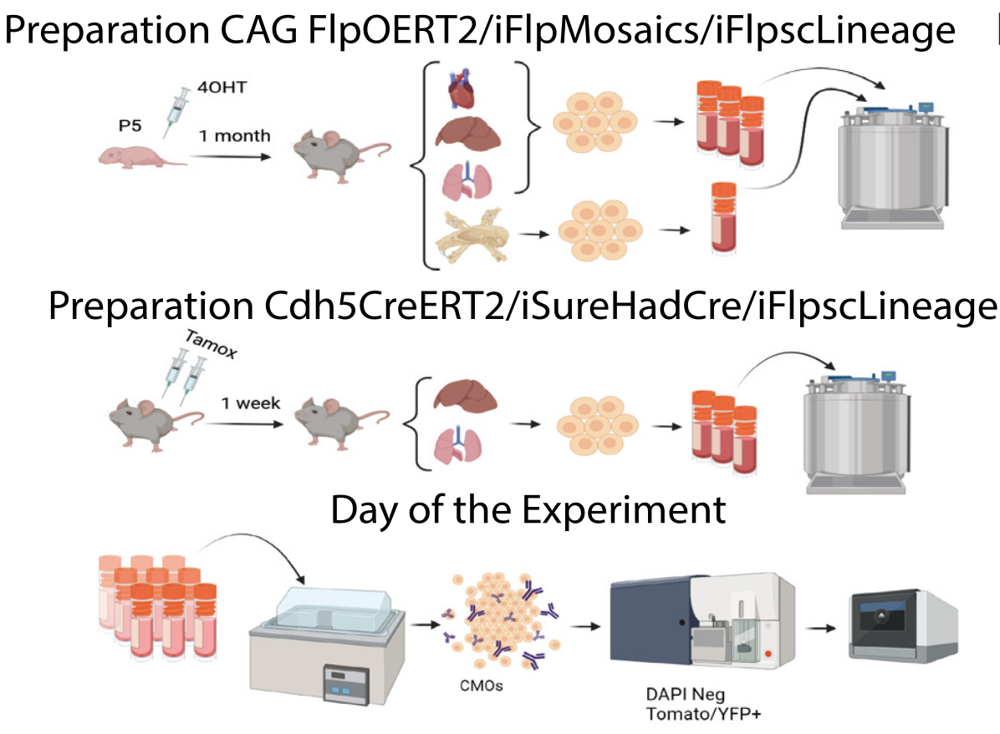
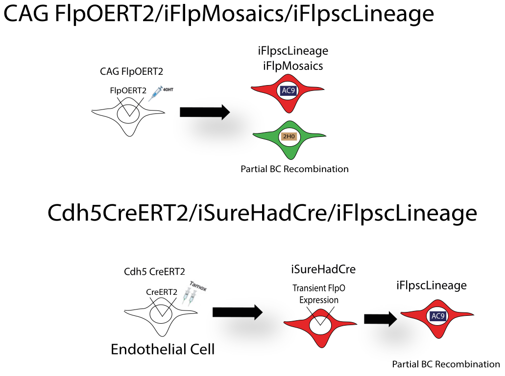

# Partial Recombination

Once iFlpscLineage was validated through the Constitutive recombination model, where it gave us valuable information of the expression levels of the barcodes, we moved onto trying Partial recombination models to understand the range of Barcode variability iFlpscLineage could offer us.

## Experimental design

Once again the experiments where carried in two different days. 

## Barcoding Strategy

